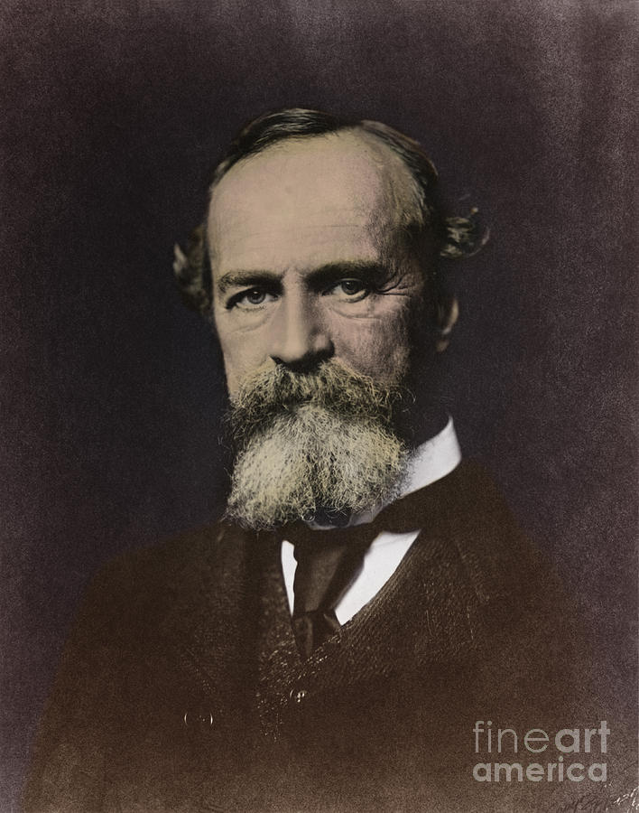

# 🎓 William James — The Me-self & I-self

A live, interactive presentation on **William James's** theory of the Self — the *I-self* (knower) and the *Me-self* (known) from *The Principles of Psychology* (1890).

---

## 🌐 View the Site

👉 **[Open the live presentation](https://vnsannn.github.io/william-james/)**

Scroll through five sections: About, The Principles of Psychology, I-self, Me-self, and Summary.

> Best viewed on a desktop browser. Fully responsive on mobile, but the custom cursor and some interactions are desktop-only.

---

### 👨‍💻 Presented by
**CALDERON, VIEN FRITZGERALD V.**
BSIT — Dalubhasaang Politekniko ng Lungsod ng Baliwag

---

## 📜 License

This repository is available for **public viewing only**. See [LICENSE.md](LICENSE.md).

---

## 📬 Contact

**Vien Fritzgerald V. Calderon**
📧 viencalderon15@gmail.com
🔗 [github.com/vnsannn](https://github.com/vnsannn)
